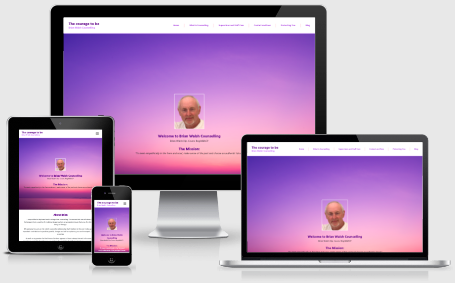

# The courage to be

<a href="http://thecouragetobe.org/" 
target="_blank">Click here to view The Courage to be live</a>

## Wireframes
### Homepage

### Protecting You Page

### Proctors Model Page

## Technologies used
### Languages 
* <a href="https://en.wikipedia.org/wiki/HTML" target="_blank">HTML5</a> - The HyperText Markup Language used to provide content to the website. 
* <a href="https://en.wikipedia.org/wiki/CSS" target="_blank">CSS3</a> - Cascading Style Sheet used to provide custom styling througout the website.
* <a href="https://alpinejs.dev/" target="_blank">Alpine JS</a> - Alpine is a rugged, minimal tool for composing behavior directly in your markup. Think of it like jQuery for the modern web. 
* <a href="https://en.wikipedia.org/wiki/Python_(programming_language)" target="_blank">Python3</a> - To create all functions that allow the website to work and interact between the application and mongoDB as well as importing several key dependencies i.e. os, flask, flash, render_template, redirect, request, session, url_for, PyMongo, ObjectId(bson.objectid),generate_password_hash, check_password_hash (werkzeug.security) and env.
* <a href="https://docs.mongodb.com/drivers/pymongo/">Pymongo</a> - Python API for MongoDB that enables me to link up the data from the back-end database to the front-end appplication.

### Frameworks and Libraries 
* <a href="https://en.wikipedia.org/wiki/JQuery" target="_blank">JQuery</a> - used as a JavaScript library to assist with Javascript to reduce coding. Used for user interaction i.e. contact form. <a href="https://en.wikipedia.org/wiki/Document_Object_Model">
* <a href="https://en.wikipedia.org/wiki/Flask_(web_framework)" target="_blank">Flask</a> - Flask is a micro web framework written in Python.
* <a href="https://en.wikipedia.org/wiki/Jinja_(template_engine)" target="_blank">Jinja Templating Language</a> - Jinja is a web template engine for the Python programming language, that assisted me with if statements, for loops and conditional logic. 
* <a href="https://tailwindui.com/" target="_blank">Tailwind CSS</a> - A utility-first CSS framework packed with classes for all styling needs

### Other technologies 
* <a href="https://developer.chrome.com/docs/devtools/" target="_blank">Chrome DevTools</a> - This tool was very useful for amending code, finding where bugs were coming from and help with all code and console errors during the time of being the feedback form page. Used to examine the overall performance of the site with Lighthouse as well. 
* <a href="https://balsamiq.com/wireframes/?gclid=CjwKCAjw6fCCBhBNEiwAem5SO0TfrA7AKJnwXKFEJStjRK5qFYRfJ7jLW6Vdt4F1CdcujCZRm9Zr7xoC3oUQAvD_BwE" target="_blank">Balsamiq</a> -  Used to create wireframes for all pages on all screen sizes. 
* <a href="https://fontawesome.com/" target="_blank">Font Awesome</a> - I used many bespoke icons and social media icons across all pages of the website. 
* <a href="https://fonts.google.com/" target="_blank">Google Fonts</a> - I used two font families on my website. I used the font Montserrat with sans-serif and fallback for most of the website content and Holtwood One SC with Serif as a fallback for the text logo. Fallbacks will only work if the main fonts fail. 
* <a href="https://gitpod.io/" target="_blank">Gitpod</a> - Used to complete my HTML, CSS, JavaScript/JQuery and Python coding for my MS3 project.
* <a href="https://github.com/" target="_blank">Github</a> - GitHub is used to store the projects code after being pushed from Git.
* <a href="https://git-scm.com/" target="_blank">Git</a> - Git was used for version control by using the Gitpod terminal to commit to Git and Push to GitHub.
* <a href="https://en.wikipedia.org/wiki/Heroku" target="_blank">Heroku</a> - Heroku is a platform as a service (PaaS) that enables developers to build, run, and operate applications entirely in the cloud.
* <a href="https://validator.w3.org/" target="_blank">W3C Markup Validation Service</a> - Used to test all HTML coding for all five pages.
* <a href="https://jigsaw.w3.org/css-validator/" target="_blank">W3C CSS Validation Service</a> - Used to test all CSS coding.
* <a href="https://jshint.com/" target="_blank">JS Hint</a> - Used to test all Javascript coding.
* <a href="http://pep8online.com/" target="_blank">Python PEP8 Online</a> - Used to test all Python coding.
* <a href="https://www.emailjs.com/" target="_blank">Email JS</a> - Used to 
send email directly from JavaScript - free of charge for up to 200 emails per month.
* <a href="https://cdnjs.com/" target="_blank">cdnjs</a> - Used to 
Used to source scripts and links for the base template.
* <a href="https://werkzeug.palletsprojects.com/en/2.0.x/utils/#module-werkzeug.security" target="_blank">Werkzeug</a> - A comprehensive WSGI (Web Server Gateway Interface) web application library. It began as a simple collection of various utilities for WSGI applications and has become one of the most advanced WSGI utility libraries. 
* <a href="https://randomkeygen.com/" target="_blank">RandomKeygen</a> - A free tool that offers randomly generated keys and passwords you can use to secure any application, service or device. I used this to generate a password when setting the secret_key password making it a fort knox password. 
* <a href="https://gauger.io/fonticon/" target="_blank">Font Icon</a> - Sourced the 'Film' Icon 
* <a href="https://en.wikipedia.org/wiki/MongoDB" target="_blank">MongoDB</a> - MongoDB is a source-available cross-platform document-oriented database program. Classified as a NoSQL database program, MongoDB uses JSON-like documents with optional schemas.
 
